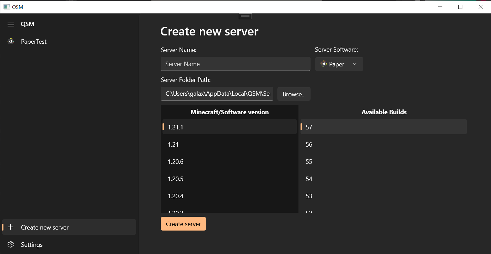

After installing QSM, You can create a new server by going
into the "Create new server" tab.

Then, You can fill out the name for your server.

Next, There are multiple choices for the server software,
Those choice are:

- Paper (Recommended Default)
- Purpur
- Vanilla
- Fabric
- NeoForge
- Velocity

You should be able to pick a software if you know what you're
doing, or else visit [this page](/QSMSharp/common/guides/choosing-a-software)
to learn about Minecraft server softwares.

The server folder path is automatically generated by default
and will place your server in QSM's default server directory
(`C:\Users\username\AppData\Local\QSM\Servers`)
But you can change the server's folder to somewhere else if
your heart desires.

Then, You can choose the Minecraft version and the server
software version on the big two list.

And finally, hit the "Create server" button!
QSM will then download the server software and bring you to
your server's dashboard page.
